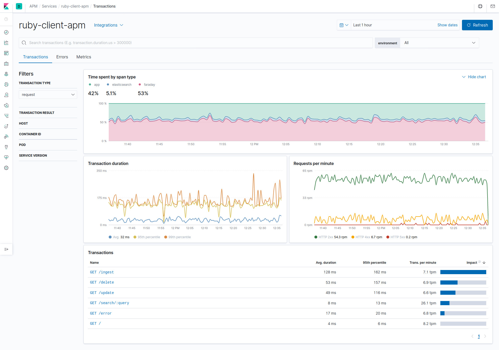

# Observability Example

The Elasticsearch Ruby client integrates seamlessly with Elastic APM via the [Elastic APM Agent](https://github.com/elastic/apm-agent-ruby). This directory includes an example Sinatra App which interacts with Elasticsearch and is configured with APM via the apm agent.

A `docker-compose` file based on the [Quick start development environment](https://www.elastic.co/guide/en/apm/get-started/current/quick-start-overview.html) for APM is provided. It gets the default distributions of Elasticsearch, Kibana and APM Server up and running in Docker. The docker-compose file also runs the basic Sinatra App and a script to ping the web app with different endpoints.

Run `docker-compose up` on the root folder of this example and you'll get everything set up. You can check the steps on the full documentation [at elastic.co](https://www.elastic.co/guide/en/apm/get-started/current/quick-start-overview.html).

[Install Docker Compose](https://docs.docker.com/compose/install/), cd into this directory and run it. You need to set the `STACK_VERSION` environment variable to set the version of the stack you want to use:

```bash
$ cd docs/examples/apm
$ STACK_VERSION=7.9.1 docker-compose up
```

The following services will be available:

- Kibana:              http://localhost:5601
- Elasticsearch:       http://localhost:9200
- APM Server:          http://localhost:8200
- Example Sinatra app: http://localhost:9292

Use your web browser or `curl` against http://localhost:9292/ to check that everything is working. You should see a JSON response from `cluster.health`.

The first time you visit the Kibana Home page in your browser, you'll need to click on "Add APM" in the Observability section. You can check the APM Server and APM Agent status there, or just scroll down to the bottom of the page and click on "Launch APM".

Use the APM app at http://localhost:5601/app/apm to visualize your application performance data!

The docker-compose file will also run a `pinger` script. This script will make requests irregularly to the web app to simulate proper traffic and fill your APM Dashboard with data, even errors. You can comment the pinger container from `docker-compose.yml` if you want to have all the services running and test the different endpoints (or add your own) by yourself.

Once you have some requests to Elasticsearch via the Sinatra app, you can see them in your APM dashboard:



If you're using `elastic-apm` v3.8.0 or up, you can set `capture_elasticsearch_queries` to `true` in `config/elastic_apm.yml` to also capture the body from requests in Elasticsearch.

# Routes in the example Sinatra app

Once the app is running, you can open the following routes in your web browser or via `curl`. The responses are in JSON:

* `/` - The root path returns the response from `cluster.health`
* `/ingest` - This will bulk insert 1,000 documents in the `games` index in slices of 250 at a time.
* `/search/{param}` - Returns search results for `param`.
* `/error` - This route will trigger an error.
* `/delete` - This route will delete all the data in the `games` index.
* `/delete/{id}` - This route will delete a document with the given id from the `games` index.
* `/update/` - This route will update the `modified` field on some docs in the `games` index.
* `/doc/{id}` - This route will return a document with a given ID from Elasticsearch.

# Data Source

Data is based on a DB dump from February 25, 2020 of [TheGamesDB](https://thegamesdb.net/) game data:  
https://cdn.thegamesdb.net/json/database-latest.json
